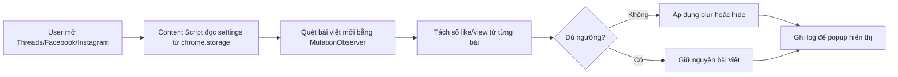
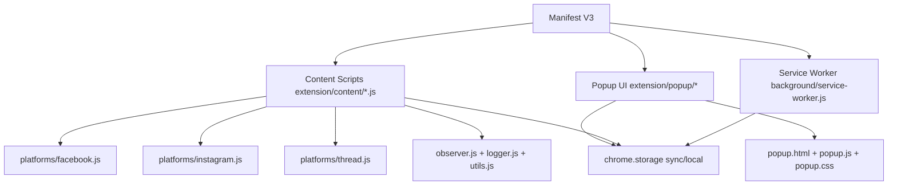
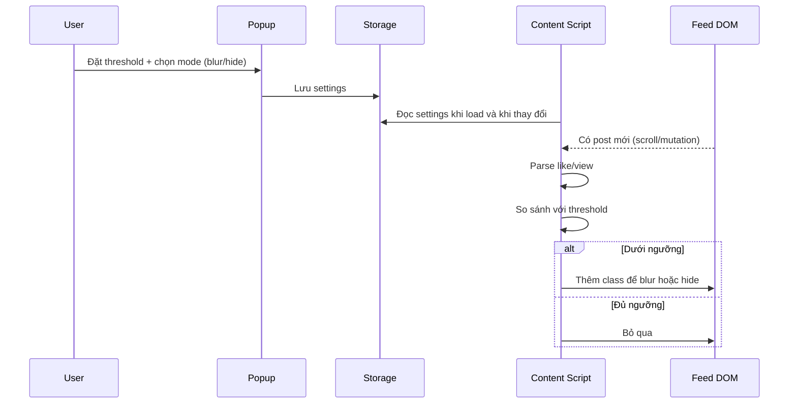

# News Feed Filter Extension

Extension này giúp giảm thời gian đọc nội dung kém chất lượng trên Threads, Facebook và Instagram bằng cách làm mờ hoặc ẩn các bài viết có lượng tương tác thấp (like/view dưới ngưỡng bạn đặt).

Repo: https://github.com/langochungdev/news-feed-filter

## Sơ đồ tổng quan

## 1) Extension này dùng để làm gì

Trung bình một người dành khoảng 10% thời gian cuộc đời để lướt mạng xã hội. Ý tưởng của extension là lọc bớt phần lớn bài viết có tín hiệu tương tác thấp để giảm nhiễu:

- Bài có like/view thấp hơn ngưỡng: bị blur hoặc hide.
- Bài có like/view cao hơn ngưỡng: giữ nguyên.
- Hoạt động theo thời gian thực khi bạn lướt feed (infinite scroll).

Mục tiêu: giúp feed sạch hơn, tập trung hơn, đỡ tốn thời gian đọc nội dung chất lượng thấp.

## 2) Công nghệ sử dụng

- Chrome Extension Manifest V3.
- JavaScript thuần (không framework), CSS, HTML cho popup.
- MutationObserver để xử lý feed tải động.
- chrome.storage để lưu cấu hình và đồng bộ trạng thái.
- Tách logic theo platform (Threads/Instagram/Facebook) để dễ bảo trì selector.

## 3) Cơ chế hide hoặc blur bài viết

- Blur mode: giữ nguyên layout, chỉ làm mờ bài viết để lướt nhanh và an toàn hơn với cấu trúc trang.
- Hide mode: thu gọn/ẩn phần hiển thị của bài viết không đạt ngưỡng.
- Không cần xóa node khỏi DOM theo cách phá cấu trúc, giúp hạn chế side effect với feed động.
- Áp dụng lại liên tục khi có bài viết mới xuất hiện.

## 4) Cách sử dụng

1. Tải repo về máy.
2. Mở Chrome, vào chrome://extensions.
3. Bật Developer mode.
4. Chọn Load unpacked và trỏ tới thư mục extension.
5. Mở popup của extension.
6. Chọn platform muốn áp dụng (Threads/Facebook/Instagram).
7. Nhập hoặc kéo ngưỡng like/view tối thiểu.
8. Chọn chế độ Blur hoặc Hide.
9. Reload tab mạng xã hội để áp dụng ngay.

## Định hướng phát triển

- Né luôn bài viết dạng "5s".
- Filter riêng cho news feed:
- Có ảnh/số lượng ảnh hoặc không.
- Highlight keyword custom hoặc đóng khung bài viết có keyword.
- Lọc theo độ dài nội dung.
